# JalSuraksha Nepal

**Know the Risk. Find Safety. Get Help.**

A flood emergency response and evacuation platform for Nepal. It turns flood
warnings and community reports into coordinated action: citizens see their risk,
get a hazard-aware route to a shelter with space and can send an SOS without an
account. Emergency operators triage and dispatch from a live operations centre,
and rescue teams update their mission status in real time.

> **Hackathon prototype.** All alerts, river levels, shelters, hazards and
> incidents are **simulated demo data** for the Narayani basin (Chitwan).
> Risk scores are transparent, rule-based decision support. They are not flood
> forecasts. A real deployment needs validated DHM/government data and
> official emergency-response partnerships.

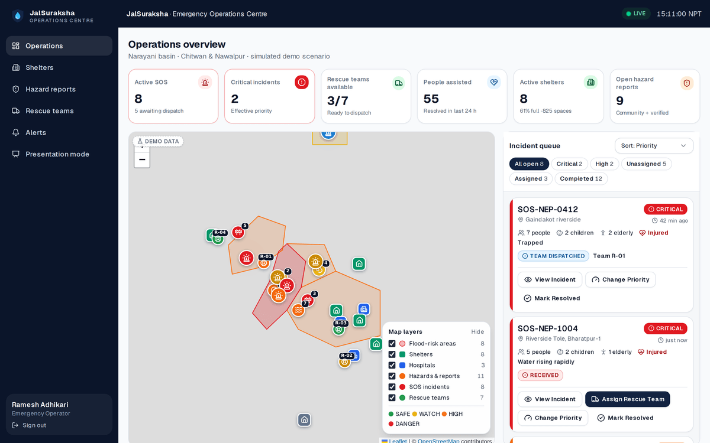

---

## Contents

- [The problem](#the-problem)
- [The solution](#the-solution)
- [Screenshots](#screenshots)
- [Features](#features)
- [Architecture](#architecture)
- [Tech stack](#tech-stack)
- [Getting started](#getting-started) (installation, environment variables, Supabase, database, demo accounts)
- [Development, testing and build](#development-testing-and-build)
- [Deployment](#deployment)
- [Hackathon demo scenario](#hackathon-demo-scenario)
- [Security considerations](#security-considerations)
- [Limitations](#limitations)
- [Future improvements](#future-improvements)

## The problem

Every monsoon, riverine and flash floods in the Terai and inner-Terai basins
(Narayani, Koshi, Karnali, Rapti, Bagmati) displace thousands of households.
Warnings exist, **but a warning alone does not coordinate evacuation and
rescue**:

- Citizens hear "the river is rising" but not *which road is still passable*
  or *which shelter still has space*.
- Requests for help arrive as phone calls and social-media posts. They are
  unstructured and nobody ranks them.
- Operators lack one live picture of incidents, teams and shelters.
- Rescue teams get assignments by phone, and their status never flows back to
  the person waiting.

## The solution

One web platform with three connected workspaces sharing one live database:

| | Citizen app (mobile) | Operations centre (desktop) | Rescue console (tablet/phone) |
|---|---|---|---|
| **Know the Risk** | Risk status with a "why is this area high risk?" breakdown, alerts, live map | Risk areas and hazards on the command map | — |
| **Find Safety** | Nearest shelter with space, hazard-aware route that re-routes live | Shelter occupancy management | — |
| **Get Help** | One-tap SOS without an account, live status timeline | Prioritised queue, assign team, override priority, resolve | Mission details, Accept → En Route → Arrived → Completed |

Every status change reaches the other two screens within about a second
through Supabase Realtime.

## Screenshots

| Citizen home | "Why is this area high risk?" | Safe route | Route updated (bridge flooded) |
|---|---|---|---|
| 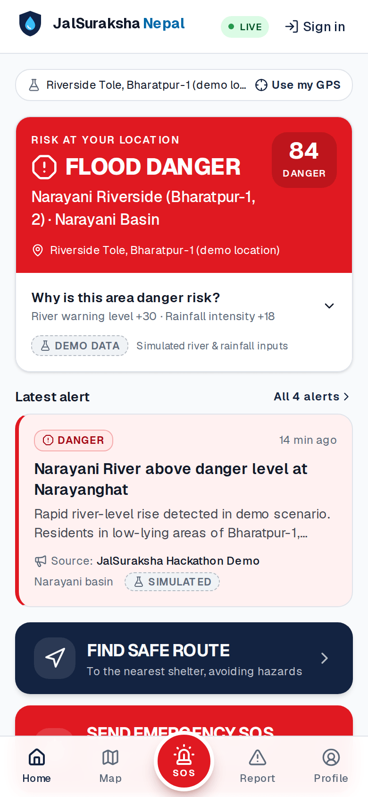 | 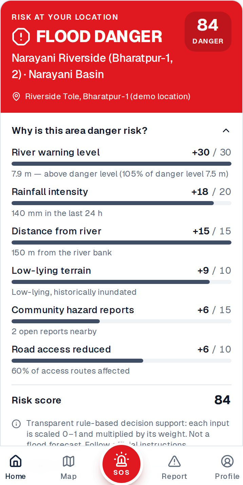 | 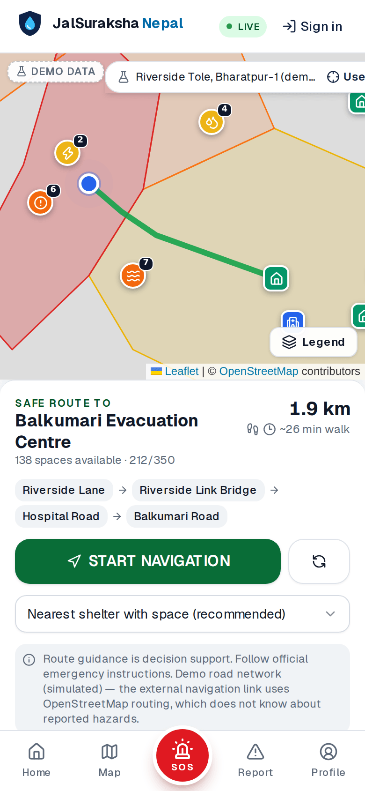 | 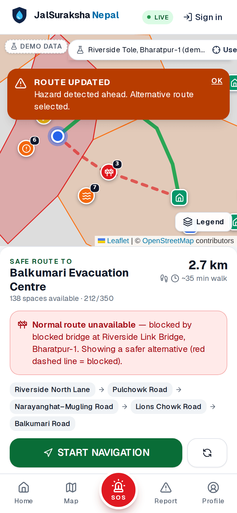 |

| SOS form | Live SOS tracking |
|---|---|
| 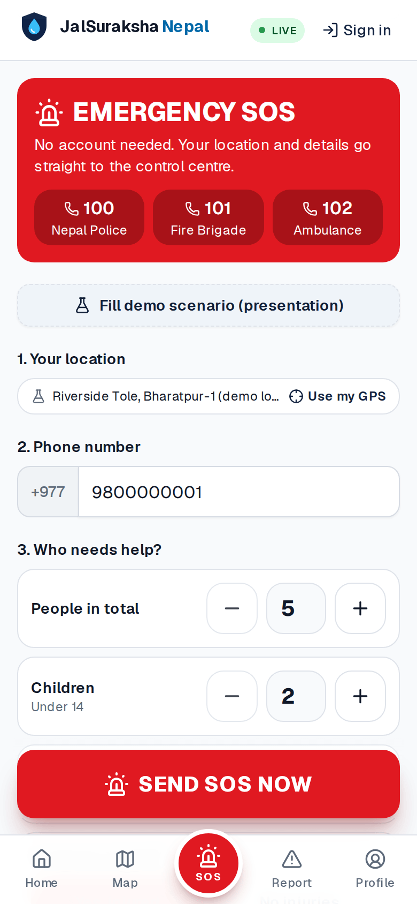 | 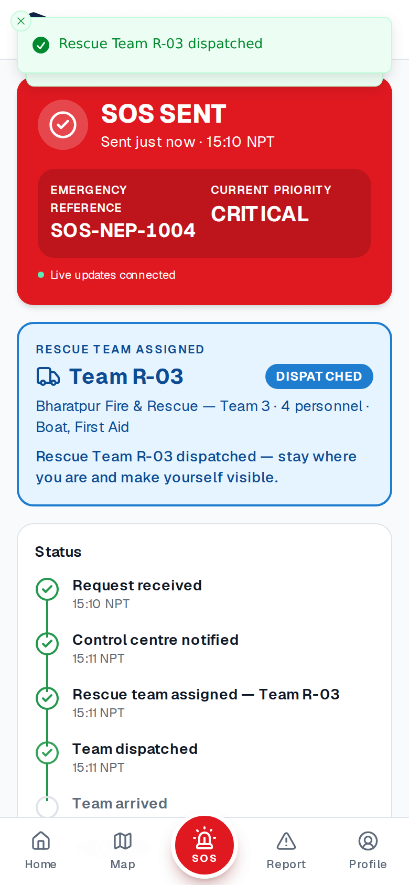 |

| Assign rescue team | Incident detail |
|---|---|
| 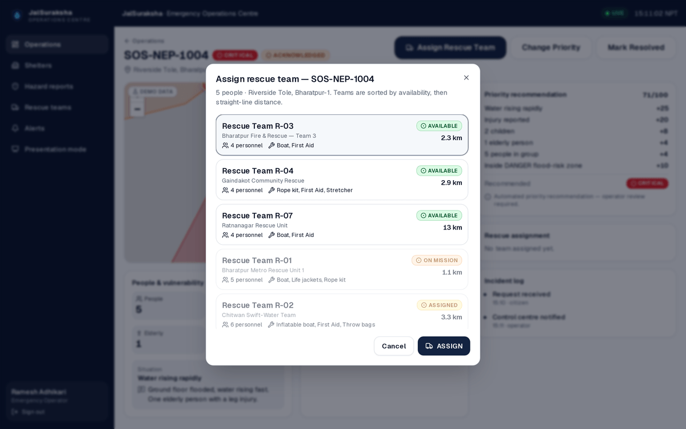 | 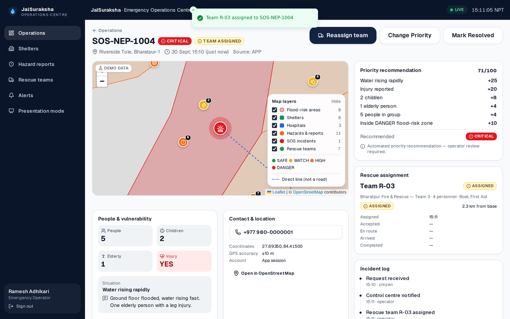 |

| Rescue console | Presentation mode |
|---|---|
| 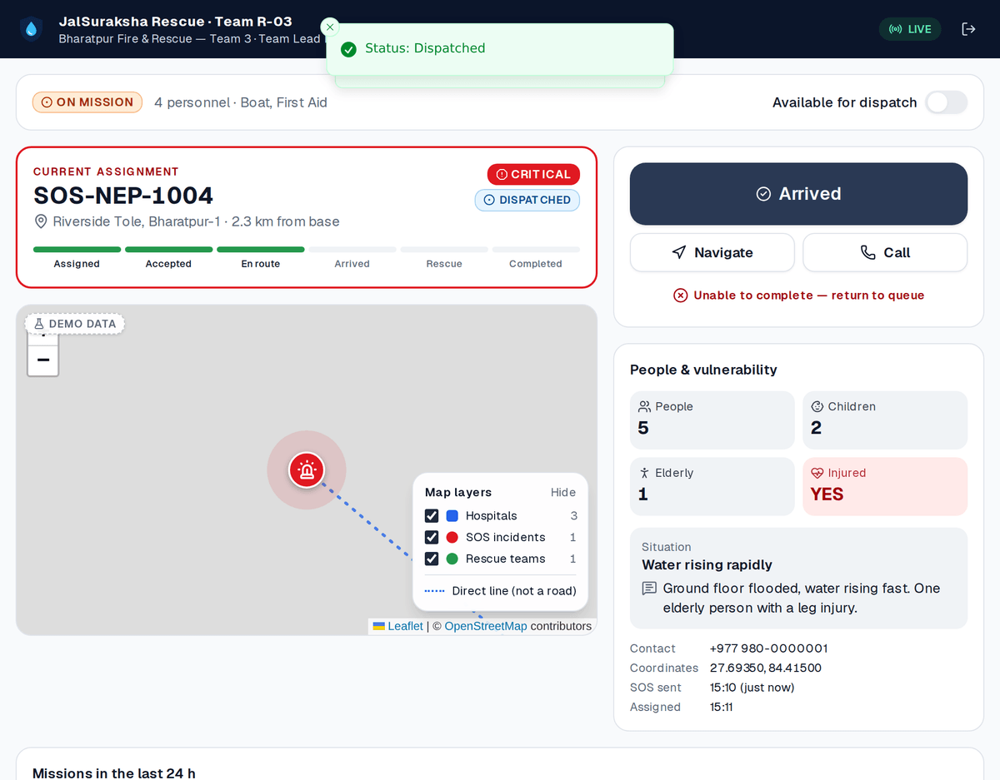 | 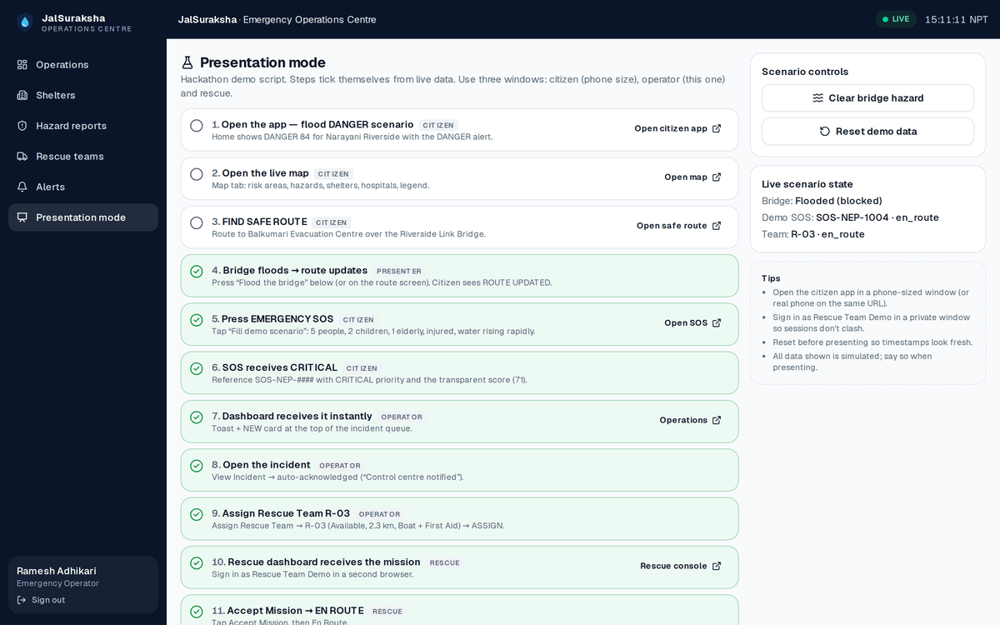 |

> The screenshots were captured in a sandbox with no internet access, so
> OpenStreetMap tiles are blank; overlays, markers and routes are real. With
> internet access the map shows streets underneath.

## Features

**Citizen (mobile-first, bottom navigation Home · Map · SOS · Report · Profile)**
- Risk status for your location (or the highest-risk area), with a transparent score breakdown
- Alerts with severity labels and an explicit source ("JalSuraksha Hackathon Demo" for simulated alerts)
- River level against warning/danger thresholds, plus 24 h rainfall
- Live Leaflet/OpenStreetMap map: risk areas, shelters, hospitals, hazards, legend and layer toggles, marker popups with *Confirm* and *Avoid route* actions
- **Find safe route**: nearest shelter with space, avoiding flooded roads, landslides and blocked bridges; the "ROUTE UPDATED" banner appears when a new hazard blocks the current route
- **Emergency SOS without an account**: GPS, phone, people, children, elderly, injury, situation, notes and a photo. You get a reference number (`SOS-NEP-####`), a priority recommendation and a realtime timeline, and can mark yourself safe
- Community hazard reports with photos, confirmations and grouping of nearby duplicates
- Family safety status: SAFE / EVACUATED / NEED HELP
- PWA: installable, offline mode with last-sync time, cached shelters, alerts, emergency numbers and safety tips

**Emergency operators**
- KPIs: active SOS, critical incidents, teams available, people assisted, active shelters, open hazards
- Large live map and a queue you can filter (critical / high / unassigned / assigned / completed) and sort (priority / time / location)
- Incident detail: vulnerability, priority factors, contact, photo, incident log. Opening an incident acknowledges it automatically
- Assign rescue team (sorted by availability and distance), change priority (with a logged reason), mark resolved
- Shelter occupancy and supplies, hazard review (verify/resolve/reject), team roster, alert publishing
- Analytics: SOS per hour by priority, shelter occupancy, median dispatch → arrival time
- Admin: user role management

**Rescue teams**
- Current mission, map, people and vulnerability, description, call and navigate buttons
- Status buttons: **Accept Mission → En Route → Arrived → Rescue In Progress → Completed**, plus *Return to queue*
- Availability toggle; new missions arrive instantly with a vibration alert

**Presentation mode:** a 14-step demo script that ticks steps off from live data, a *Flood the bridge* control and a one-click *Reset demo data*.

## Architecture

```
Browser: citizen phone · operator desktop · rescue tablet
   │  React Server Components + Client Components
   │  supabase-js ── Realtime websocket (RLS-filtered per user) ─────────────┐
   ▼                                                                         │
Next.js 16 (Vercel)                                                          │
   ├─ proxy.ts        refresh auth cookie, optimistic sign-in gating         │
   ├─ Server Components  read data as the signed-in user (RLS applies)       │
   ├─ Server Actions  mutations → Postgres workflow functions (role-checked) │
   └─ Route handlers  /api/sos (guest SOS) · /api/sos/track · /api/uploads   │
                      /api/public/snapshot · /api/demo · /api/sms/inbound    │
   ▼                                                                         │
Supabase: Postgres + RLS + SECURITY DEFINER workflow functions ──────────────┘
          Auth (phone OTP, email, anonymous) · Storage · Realtime
```

Key decisions:

- **Workflow logic lives in Postgres.** `assign_rescue_team`, `update_assignment_status`,
  `set_sos_priority_override`, `resolve_sos` and the others check the caller's role
  (read from `profiles`), validate state transitions, update related rows and
  write the audit log atomically. The UI can't put an incident into an invalid state.
- **Guest SOS.** The browser silently creates an anonymous Supabase session so
  the person receives realtime updates for their own SOS. A secret tracking
  token is the fallback, with polling every 6 s.
- **Transparent engines.** `lib/risk-engine` and `lib/routing` are pure,
  unit-tested TypeScript with configurable weights and rules.
- **One dataset for seed and reset.** `lib/demo/dataset.ts` generates
  `supabase/seed.sql` and also powers the in-app *Reset demo data*, so the two
  can't drift apart.

See [`docs/ARCHITECTURE.md`](docs/ARCHITECTURE.md) and [`PROJECT_SPEC.md`](PROJECT_SPEC.md) (the source of truth).

### Project structure

```
app/            routes: citizen/, dashboard/, rescue/, auth/, api/, offline/
components/     alerts/ dashboard/ map/ rescue/ shelter/ sos/ shared/ ui/ (shadcn-style)
lib/            auth/ supabase/ risk-engine/ routing/ validation/ utilities/ services/ demo/
types/          generated database types + domain types
supabase/       config.toml, migrations/, seed.sql (generated), tests/ (pgTAP)
scripts/        create-demo-users.ts, generate-seed.ts, generate-icons.mjs, generate-marker-icons.mjs
tests/          Vitest unit tests
docs/           architecture, demo script, deployment, screenshots
```

## Tech stack

Next.js 16 (App Router, Turbopack) · React 19 · TypeScript · Tailwind CSS v4 ·
shadcn/ui-style components on Radix · Lucide · Supabase (PostgreSQL, Auth,
Realtime, Storage) · Leaflet + react-leaflet + OpenStreetMap · Recharts · Zod ·
React Hook Form · Vitest · pgTAP · Vercel.

## Getting started

### Prerequisites

- Node.js 20.9+ (22 recommended) and npm
- Docker, if you want to run Supabase locally (recommended), **or** a hosted Supabase project

### 1. Installation

```bash
git clone <your-repo-url> jalsuraksha && cd jalsuraksha
npm install
cp .env.example .env.local
```

### 2. Environment variables

| Variable | Where | Purpose |
|---|---|---|
| `NEXT_PUBLIC_SUPABASE_URL` | browser + server | Supabase project URL |
| `NEXT_PUBLIC_SUPABASE_PUBLISHABLE_KEY` | browser + server | Publishable key (`sb_publishable_…`) or the legacy anon key (`NEXT_PUBLIC_SUPABASE_ANON_KEY` also works) |
| `SUPABASE_SECRET_KEY` | **server only** | Secret key (`sb_secret_…`) or the legacy service-role key (`SUPABASE_SERVICE_ROLE_KEY` also works). Used for guest SOS intake, uploads and demo tools |
| `NEXT_PUBLIC_DEMO_MODE` | browser + server | `true` enables demo-account buttons, scenario controls and the simulated citizen location |
| `DEMO_ACCOUNT_PASSWORD` | **server only** | Shared password for the four demo accounts (8+ characters) |
| `SMS_GATEWAY_SECRET` | **server only** | Enables the future SMS inbound endpoint. Leave empty to keep it disabled |

The secret key and the demo password are never sent to the browser.

### 3. Supabase setup

**Option A: local (Docker)**

```bash
npm run db:start      # starts Postgres, Auth, Realtime, Storage; applies migrations + seed
npx supabase status   # copy API URL, publishable key and secret key into .env.local
```

The local config (`supabase/config.toml`) already enables anonymous sign-ins
(guest SOS) and the demo phone numbers `9800000001` / `9800000002`, which use
OTP code `123456` without sending an SMS.

**Phone sign-in with any number.** Supabase hands each login code to the app
(`/api/auth/send-sms`, the "Send SMS" auth hook). In development with no
Twilio keys, the code is printed in the terminal running `npm run dev`
(`[dev-sms] Login code for +977…: 123456`), so any real number can sign in
locally without a paid provider. Put `TWILIO_*` values in `.env.local` to send
real SMS instead (setup: [`docs/DEPLOYMENT.md`](docs/DEPLOYMENT.md)). Production
builds never print codes. Generate a hook secret
(`echo "v1,whsec_$(openssl rand -base64 32)"`) and set it as
`SEND_SMS_HOOK_SECRET` in **both** `.env.local` and `supabase/.env.local`
(both git-ignored; `supabase/config.toml` reads the latter) before
`npm run db:start`. The dev server must run on port 3000, where Supabase calls it.

**Option B: hosted Supabase**: see [`docs/DEPLOYMENT.md`](docs/DEPLOYMENT.md#1-supabase). In brief:

1. Create a project, then `npx supabase link --project-ref <ref>` and `npx supabase db push`.
2. Load the demo data: paste `supabase/seed.sql` into the SQL editor (or `psql "$DB_URL" -f supabase/seed.sql`).
3. Authentication → Sign In / Providers: enable **Anonymous sign-ins**, and enable **Phone** with an SMS provider. Add test number `9779800000001` with code `123456`.

### 4. Database setup

Migrations in `supabase/migrations/`:

| Migration | Contents |
|---|---|
| `…01_core_schema.sql` | enums, 10 tables, indexes, `updated_at` + audit triggers, SOS reference sequence, profile-on-signup trigger |
| `…02_rls.sql` | role helpers, profile privilege guard, RLS policies on every table |
| `…03_workflows.sql` | acknowledge / assign / status / override / resolve / cancel functions |
| `…04_realtime_storage.sql` | realtime publication, `sos-photos` (private) and `hazard-photos` (public) buckets |
| `…05_guest_sos.sql` | token-based "I am safe now" for guests |
| `…06_hardening.sql` | anonymous sessions can't post/confirm hazards; deadlock-free lock order; dispatch conflict guard |
| `…07_visibility_broadcast.sql` | broadcast `{table, id}` when an alert is withdrawn, a shelter closed or a hazard rejected, so citizen screens drop it live |
| `…08_no_self_confirmation.sql` | reporters cannot confirm their own hazard report |
| `…09_citizen_updates.sql` | family safety changes stream live to staff; missions closed by a citizen marking safe are labelled for the rescue team |
| `…10_real_data.sql` | live DHM stations/readings, data mode setting, gauge-linked alerts, facilities, ward boundaries, shelter verification/provenance |
| `…11_team_locations.sql` | live rescue team positions, visible only to staff, the team and the citizen it is rescuing |

Useful commands:

```bash
npm run db:reset            # re-apply migrations + seed locally
npm run db:types            # regenerate types/database.types.ts
npm run db:seed:generate    # regenerate supabase/seed.sql from lib/demo/dataset.ts
npm run db:test             # pgTAP security & workflow tests
```

### 5. Real data (live rivers, reference data, real-road routing)

```bash
npm run data:import        # wards, hospitals/health facilities, helipads, fire stations, candidate shelters (~20 s)
npm run routing:download   # Nepal OpenStreetMap extract (~400 MB)
npm run routing:up         # self-hosted Valhalla; first start builds tiles, then serves :8002
```

Set `VALHALLA_URL=http://localhost:8002` in `.env.local`. Live DHM river and
rain readings sync automatically (every 10 minutes while the app is used;
**Dashboard → Data sources → Sync now** forces it). Without Valhalla the app
uses its offline demo road network and labels routes approximate. Everything
about sources, freshness rules, automatic alerts, scheduling and shelter
verification: [`docs/REAL_DATA.md`](docs/REAL_DATA.md).

### 6. Demo accounts

```bash
npm run demo:users   # creates/updates 4 accounts using DEMO_ACCOUNT_PASSWORD
```

| Account | Email | Role |
|---|---|---|
| Citizen Demo | `citizen@demo.jalsuraksha.np` (phone `+977 9800000001`) | citizen |
| Operator Demo | `operator@demo.jalsuraksha.np` | operator |
| Rescue Team Demo | `rescue@demo.jalsuraksha.np` | rescue (Team R-03) |
| Admin Demo | `admin@demo.jalsuraksha.np` | admin |

On `/auth/login`, the **Hackathon demo accounts** buttons sign in on the server
with the password from the environment. The password never appears in client
code. The script is idempotent, so you can run it again to reset passwords or
roles. Roles are assigned with the service key; users can't change their own role.

## Development, testing and build

```bash
npm run dev         # http://localhost:3000
npm run lint        # ESLint
npm run typecheck   # route types + tsc
npm test            # Vitest unit tests
npm run db:test     # pgTAP database tests (needs local Supabase)
npm run build       # production build
npm run check       # lint + typecheck + test + build
```

`next dev` only serves its client scripts to `localhost` and the hosts listed
in `allowedDevOrigins` (`next.config.ts`: `127.0.0.1`, `192.168.*.*`,
`10.*.*.*`, so you can test on a phone over Wi‑Fi). On any other host the page
renders but never hydrates, so no button works; add that host there. The
service worker (offline mode) is only registered in production builds
(`npm run build && npm start`).

Test coverage:
- **Unit (Vitest, 132 tests):** flood risk engine, SOS priority engine, routing (including the demo re-route), Valhalla routing (polyline decoding, hazard exclusion, blocked baseline), live DHM readings (freshness, station selection, stale "above danger" handling, gauge alerts), reference-data import (de-duplication, ward ring assembly), incident state machines, role authorization, input validation, upload magic bytes, SMS parser and delivery, ops metrics, OTP error mapping.
- **Database (pgTAP, 50 tests):** team-position privacy, data-mode and live-reading write protection, facilities admin-only, closed-until-capacity shelters, RLS isolation between citizens, anonymous/guest-session limits, role-escalation guard, workflow authorization and transitions, no double-booking of teams, dispatch conflicts between operators, no self-confirmation of hazards, visibility broadcast triggers.
- **End to end (scripted with Playwright during development, not committed):** the full 14-step scenario across three browsers; phone OTP; GPS denied + no anonymous auth; operator connection drop and recovery. An axe WCAG 2 A/AA audit passes on all 18 screens, with no horizontal overflow at 360 px.

## Deployment

Vercel + hosted Supabase. The step-by-step guide is in
[`docs/DEPLOYMENT.md`](docs/DEPLOYMENT.md). Short version:

1. Set up the hosted Supabase project (migrations, seed, auth settings).
2. Import the repo in Vercel, add the environment variables above, and deploy.
3. Add the Vercel URL to Supabase **Auth → URL configuration**.
4. Run `npm run demo:users` locally with the hosted keys in `.env.local`.

## Hackathon demo scenario

The full script with talking points is in [`docs/DEMO_SCRIPT.md`](docs/DEMO_SCRIPT.md).
Open three windows: citizen (phone-sized), operator and rescue (private window).
**Presentation mode** (`/dashboard/demo`) ticks off steps 4–14 from live data
as you go (steps 1–3 are just screens to show).

1. Citizen opens the app: **FLOOD DANGER 84**, Narayani Riverside.
2. Opens the live map.
3. **Find safe route**: Balkumari Evacuation Centre via the Riverside Link Bridge.
4. Presenter floods the bridge: **ROUTE UPDATED**, new route via Pulchowk.
5. **Emergency SOS**, then "Fill demo scenario": 5 people, 2 children, 1 elderly, injured, water rising rapidly.
6. SOS gets **CRITICAL** (score 71, every factor shown).
7. The operations centre receives it instantly (toast + NEW card).
8. The operator opens the incident, which acknowledges it automatically.
9. The operator assigns **Rescue Team R-03**.
10. The rescue console receives the mission.
11. The rescue team taps **Accept Mission → En Route**.
12. The citizen sees **"Rescue Team R-03 dispatched"**.
13. The rescue team marks **Arrived → Completed**.
14. The analytics update (people assisted, teams available, charts).

### Pre-demo checklist (5 minutes before judging)

1. Open `/dashboard/demo` as Operator Demo and press **Reset demo data**.
2. Check that **System check** says **Ready to present** (env, database, demo data, R-03 available, demo accounts).
3. Open the three windows. The header pill should say **LIVE** on the operator screen.
4. Check the citizen window shows the demo location chip ("Riverside Tole … (demo location)").
5. If the venue Wi-Fi blocks OpenStreetMap, the map shows a "Street map unavailable" label; overlays and routes still work.

`GET /api/health` returns `{ ok }` publicly (for uptime monitors) and the detailed checklist to signed-in staff.

## Security considerations

- **Row Level Security on every table**, default deny. Anonymous visitors can
  read only active alerts, risk zones, open shelters and hazard reports.
- **SOS privacy:** people can read only their own SOS. Operators read all
  SOS, and a rescue team reads only incidents assigned to it. No client can
  insert or update SOS rows directly: intake goes through `/api/sos` (Zod-validated,
  rate-limited, duplicate-protected), and changes go through role-checked database functions.
- **Roles come from the database.** A trigger blocks role or team changes
  unless an admin makes them. Client-supplied role values are ignored, and the
  tests cover this.
- **Secrets stay on the server:** `lib/supabase/admin.ts` imports `server-only`,
  and a build scan confirmed no secret keys in client bundles.
- **Uploads:** JPEG/PNG/WebP only, 5 MB maximum, checked by magic bytes rather than the file
  extension, with random server-generated names. SOS photos sit in a private bucket and
  staff view them through 30-minute signed URLs. Hazard photo URLs must point at our own bucket.
- **Safe errors:** database errors are mapped to friendly messages and logged
  server-side. Redirect targets are checked to stop open redirects.
- **Headers:** `X-Content-Type-Options`, `X-Frame-Options: DENY`,
  `Referrer-Policy` and a `Permissions-Policy` limiting geolocation and camera to the app itself.
- **Demo tools:** `/api/demo` is disabled unless `NEXT_PUBLIC_DEMO_MODE=true`,
  and the full reset requires an operator. **Set demo mode to `false` for any real deployment.**
- **Guest sessions** (anonymous auth) can only own their SOS. The database
  refuses hazard reports and confirmations from them, so nobody can mint
  sessions to fake a blocked bridge.
- **Concurrency:** workflow functions lock rows in a fixed order (no
  deadlocks), and a second operator with a stale screen gets a clear
  "changed by another operator" message instead of silently overwriting a dispatch.
- The rate limiter is in-memory per server instance. Use a shared store
  (e.g. Redis/Upstash) in production.

## Limitations

- **All situational data is simulated.** DHM river gauges and rainfall are not integrated yet.
- The risk score is **rule-based decision support**. It is not a flood prediction and not machine learning.
- Routing uses a **simplified demo road network around Bharatpur**. It doesn't
  guarantee physical safety: *"Route guidance is decision support. Follow official emergency instructions."*
  The external "Start navigation" link uses OpenStreetMap routing, which doesn't know about reported hazards.
- Locations are approximate. Shelter and team names are illustrative and phone numbers are fake.
- Real SMS login codes need Twilio credentials (`TWILIO_*`); without them, development prints codes to the dev terminal and production refuses honestly. Test numbers always work.
- No telecom SMS fallback gateway is connected; only the parser and endpoint exist.
- The SOS priority score orders the queue. It never decides who deserves rescue, and operators review every request.

## Future improvements

- DHM hydrology/rainfall API integration and a risk model validated with domain experts
- SMS/USSD SOS through an NTA-licensed gateway (the `SOS 5 2 1` parser is ready)
- Nepali language (i18n) and voice prompts
- Web push notifications for alerts and SOS status
- Offline SOS queue with background sync
- PostGIS spatial queries and real road-network routing (self-hosted OSRM/Valhalla on OSM data)
- Integration with the NDRRMA BIPAD portal and municipal emergency operations centres
- Volunteer management, shelter supply logistics and team GPS tracking
- AI-assisted hazard-photo classification ("verify before operational use"). Optional, and only after field validation

---

JalSuraksha Nepal · Hackathon prototype · Map data © OpenStreetMap contributors
